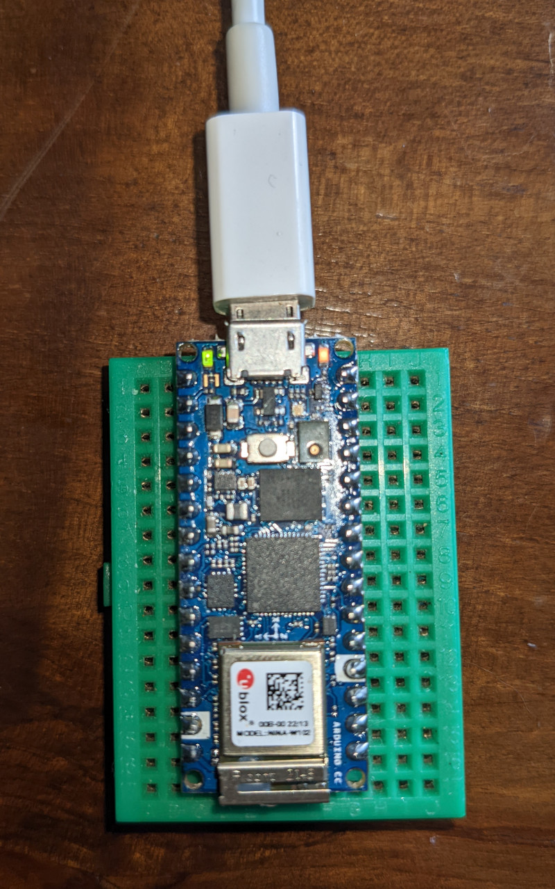
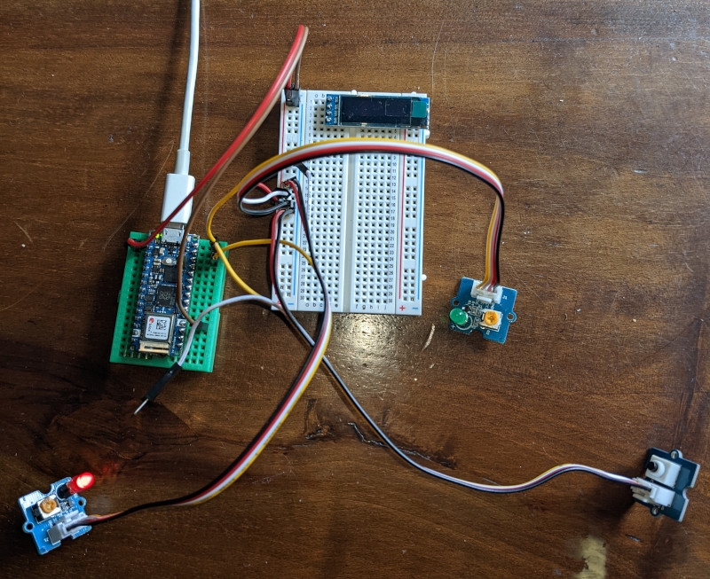
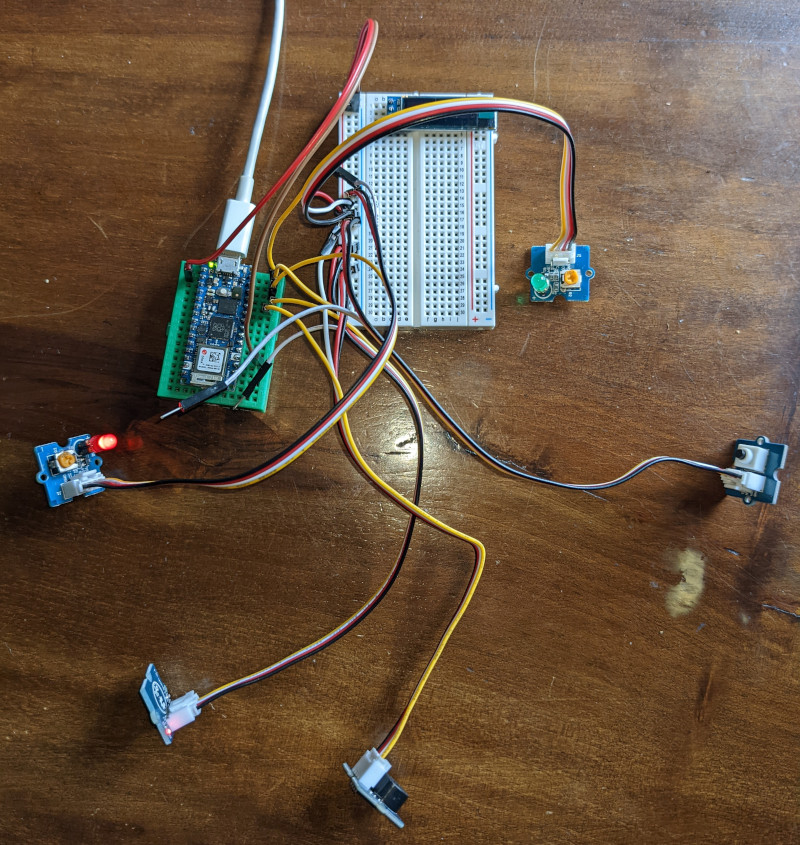
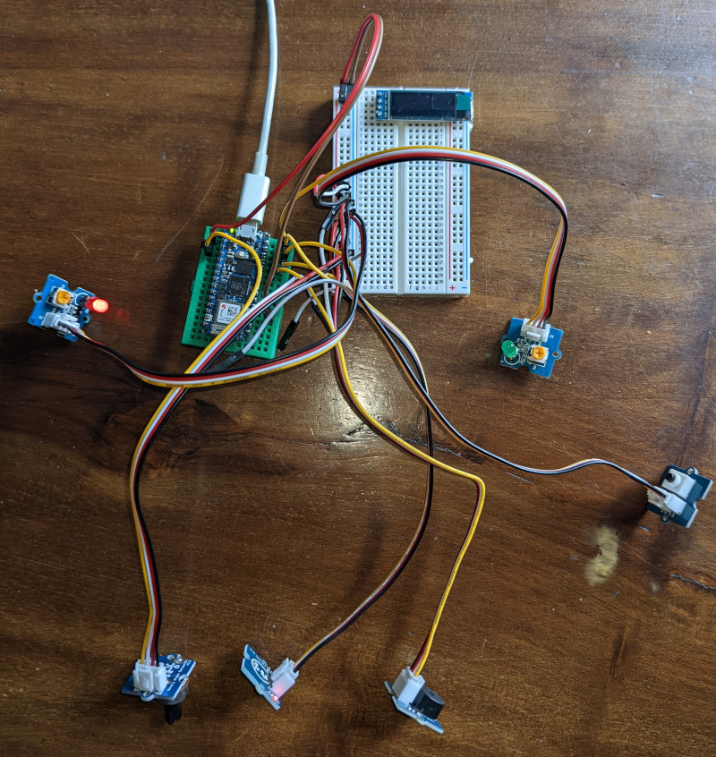

# Arduino Sensor Station

## What you need

    - Arduino Nano RP2040 Connect IoT board
    - Grove IoT Starter Kit parts
    - Personal computer with Go 1.18+ and TinyGo installed, and a serial port.

## Installation

### Go 1.18

If somehow you have not installed Go 1.18 on your computer already, you can download it here:

https://golang.org/dl/

Now you are ready to install TinyGo.

### TinyGo

You will need to install the TinyGo 0.25.0-beta1 in order to do today's activities.

You can find it at https://github.com/tinygo-org/tinygo/releases/tag/v0.25.0-beta1

Download the version for your OS, then follow these instructions here for your operating system:

<b>MacOS</b>

https://tinygo.org/getting-started/install/macos/#alternative-installation

Substitute the v0.25.0-beta1 in the above commands.

<b>Linux</b>

https://tinygo.org/getting-started/install/linux/#ubuntudebian

Substitute the v0.25.0-beta1 in the above commands.

<b>Windows</b>

https://tinygo.org/getting-started/install/windows/#manual-install

Substitute the v0.25.0-beta1 in the above commands.


### TinyGo drivers

All of the code dependencies you will need are already in the Go modules file in this directory, so they will be downloaded and installed automatically. You don't need to do anything, when you follow the subsequent instructions they will be downloaded by TinyGo.

Just for your information, the TinyGo drivers that let you connect to sensors, displays, and other external peripheral devices are located in the separate repository at https://github.com/tinygo-org/drivers


## Connecting the Arduino Nano RP2040 Connect to your computer


Plug the Arduino Nano RP2040 Connect into your computer using a USB cable. There may be one provided in your starter kit.

## Running the code

The TinyGo programs will run directly on the Arduino microcontoller. The procedure is basically:

- Edit your TinyGo program.
- Compile and flash it to your Arduino.
- The program executes from the Arduino. You can disconnect the Arduino from your computer and plug it into a battery if you wish, the program executes directly on the microcontroller.

Let's get started!

## Code

### step0.go - Built-in LED



This tests that you can compile and flash your Arduino with TinyGo code, by blinking the built-in LED.

Run the following command to compile your code, and flash it onto the Arduino:

```
tinygo flash -target nano-rp2040 ./step0/main.go
```

Once the Arduino is flashed correctly, the built-in amber LED to the right of the USB jack should start to turn on and off once per second. Now everything is setup correctly and you are ready to continue.


### step1.go - Green LED


Now lets do the same thing, but instead of using the built-in LED we will use a separate LED that we will connect from the parts kit.

- Connect one of the "Ground" pins on the Arduino to the breadboard's ground rail (-) using a black or brown jumper cable.

- Connect the "3.3V" pin on the Arduino to the breadboard's power rail (+) using a red jumper cable.

- Plug the Grove green LED into the provided cable with the Grove connector on one end, and the male jumpers on the other. Make sure the LED itself is plugged into the Grove board.

- Connect the black male end of the Grove cable to the breadboard's ground rail (-).

- Connect the red male end of the Grove cable to the breadboard's power rail (+).

- Connect the yellow male end of the Grove cable to pin D12 on the Arduino.


Run the code.

```
tinygo flash -target nano-rp2040 ./step1/main.go
```

You should see the green LED blink.


### step2.go - Green LED, Button


Next, we will attach a push button. The button will control the LED we added in the previous step. When you push the button, the LED will turn on. When you release the button, it will turn off.

- Plug the Grove Button into a provided cable with the Grove connector on one end, and the male jumpers on the other.

- Connect the black male end of the Grove cable to the breadboard's ground rail (-).

- Connect the red male end of the Grove cable to the breadboard's power rail (+).

- Connect the yellow male end of the Grove cable to pin D11 on the Arduino.


Run the code.

```
tinygo flash -target nano-rp2040 ./step2/main.go
```

When you press the button, the green LED should turn on.


### step3.go - Green LED, Button, Red LED



Now we will add a second LED, that will will also control with the same push button. One LED will be on with the button is pushed, and the other will be on when the button is released.

- Plug the Grove red LED into one of the provided cable with the Grove connector on one end, and the male jumpers on the other.

- Connect the black male end of the Grove cable to the breadboard's top left set of pins (-).

- Connect the red male end of the Grove cable to the breadboard's top right (+) set of pins.

- Connect the yellow male end of the Grove cable to pin D10 on the Arduino.

Run the code.

```
tinygo flash -target nano-rp2040 ./step3/main.go
```

The red LED should light up. When you press the button, the green LED should turn on, and the red LED should turn off. When you release the button, the green LED should turn off, and the red LED should turn on again.

### step4.go - Green LED, Button, Red LED, Buzzer, Touch



In this step we will add two new devices. The first one is a capacitive touch sensor. It essentially acts like a button, but you only need to touch it to activate it. The second is a small piezoelectric buzzer. When current is sent to the buzzer, it makes a noise.

- Plug the Grove touch sensor into one of the provided cables with the Grove connector on one end, and the male jumpers on the other.

- Connect the black male end of the Grove cable to the breadboard's top left set of pins (-).

- Connect the red male end of the Grove cable to the breadboard's top right (+) set of pins.

- Connect the yellow male end of the Grove cable to pin D9 on the Arduino.

- Plug the Grove buzzer into one of the provided cables with the Grove connector on one end, and the male jumpers on the other.

- Connect the black male end of the Grove cable to the breadboard's top left set of pins (-).

- Connect the red male end of the Grove cable to the breadboard's top right (+) set of pins.

- Connect the yellow male end of the Grove cable to pin D8 on the Arduino.

Run the code.

```
tinygo flash -target nano-rp2040 ./step4/main.go
```

When you touch the touch sensor, the buzzer should emit a noise.


### step5.go - Green LED, Button, Red LED, Buzzer, Touch, Dial



The next device we will add is a rotary dial. The rotary dial is an analog device. The amount of voltage that is allowed to pass through it is based on how far you turn the dial. 

In order to read whatever voltage is going thru the dial, we will need to use an [Analog to Digital Converter (ADC)](https://en.wikipedia.org/wiki/Analog-to-digital_converter). The Arduino Nano RP 2040 connect has several ADC onboard for us to use.

We will use this to control the brightness of the red LED. To do this, we will need to switch from just a digital on or off signal, to use [Pulse Width Modulation (PWM)](https://en.wikipedia.org/wiki/Pulse-width_modulation). We can use PWM to make the LED brighter or dimmer.

- Plug the Grove dial (Rotary Angle Sensor) into one of the provided cables with the Grove connector on one end, and the male jumpers on the other.

- Connect the black male end of the Grove cable to the breadboard's top left set of pins (-).

- Connect the red male end of the Grove cable to the breadboard's top right (+) set of pins.

- Connect the yellow male end of the Grove cable to pin A0 on the Arduino.


Run the code.

```
tinygo flash -target nano-rp2040 ./step5/main.go
```

Adjusting the dial sensor should control the brightness of the red LED.


### step6.go - Green LED, Button, Red LED, Buzzer, Touch, Dial, OLED display


Now we will add a SSD1306 OLED display to show the state of the buttons and dial. We will control this display using an [I2C interface](https://en.wikipedia.org/wiki/I%C2%B2C).

- Connect a jumper wire from the "GND" pin on the breadboard next to the OLED display, to the breadboard's top left set of pins (-).

- Connect a jumper wire from the "VCC" pin on the breadboard next to the OLED display, to the breadboard's top right (+) set of pins.

- Connect a jumper wire from the "SDA" pin on the breadboard next to the OLED display, to the Arduino Nano RP2040 A4 pin.

- Connect a jumper wire from the "SCL" pin on the breadboard next to the OLED display, to the Arduino Nano RP2040 A5 pin.


We have 2 TinyGo packages to make it easier to use small displays such as the SSD1306 in the kit. 

The TinyFont package renders fonts to any of the supported displays in the TinyGo drivers repo. 

The TinyDraw package has a number of drawing primitives like circles, lines, and triangles that can be used with any of the supported displays.

Run the code.

```
tinygo flash -target nano-rp2040 ./step6/main.go
```

The dial should now cause the OLED display to show its current position. The OLED should also have two empty circles that will light up when you press the Button to light up the Blue LED and when you press the touch sensor respectively.


### step7.go - Green LED, Button, Red LED, Buzzer, Touch, Dial, MQTT


In this step we will connect to a machine to machine messaging server using the [MQTT machine to machine messaging protocol](https://en.wikipedia.org/wiki/MQTT). No additional hardware is required for this step.

Substitute the correct values for your WiFi setup in the following command:

```
tinygo flash -target nano-rp2040 -ldflags="-X main.ssid=MYSSID -X main.pass=MYPASS" ./step7/main.go
```

How to tell if it is working...

```
mosquitto_sub -h 'test.mosquitto.org' -t 'tinygo'
```

When you run this command, you should be able to see the messages appear. These are being sent from your own machine to an MQTT broker provided by the Eclipse Foundation and running on a cloud server that they provide.
